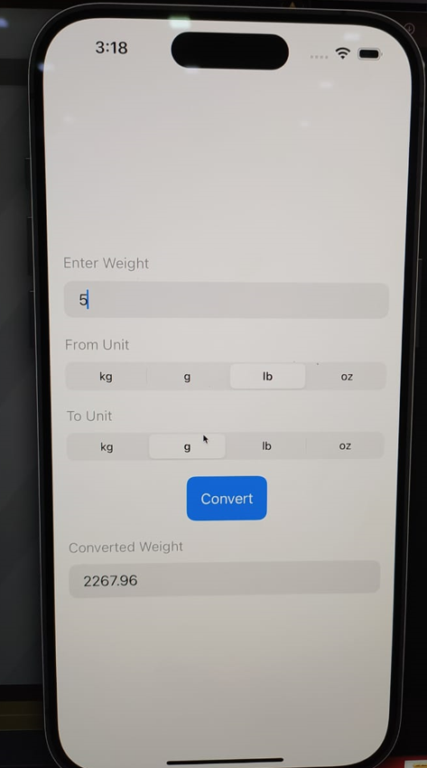

# Weight Converter

Weight Converter is a basic app that can convert weights. The app supports conversion among kilograms, grams, ounces, and pounds. The app is built using the SwiftUI framework in Swift. The app is simple, easy to use and modular. 

## Screenshots




## Installation

1. Clone the repository

    ```bash
    git clone https://github.com/Faruk982/Weight_Converter.git
    ```

2. Open the project in Xcode

3. Build and run the app

## Acknowledgements

* Inspired by SwiftUI tutorials in youtube
* The official documentation of SwiftUI
